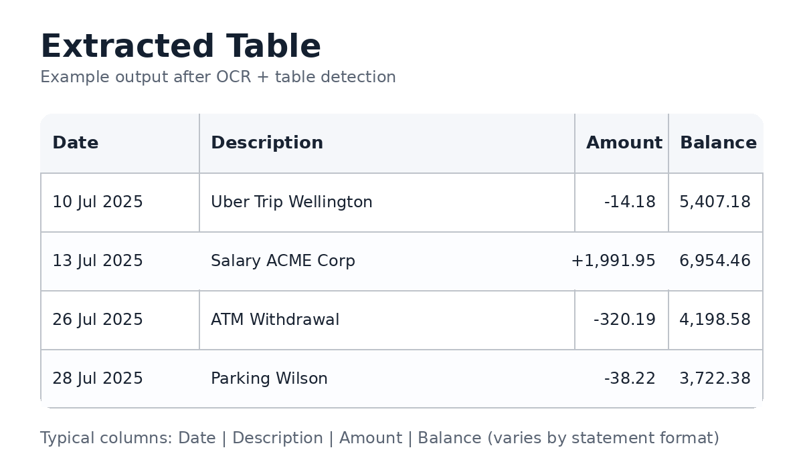
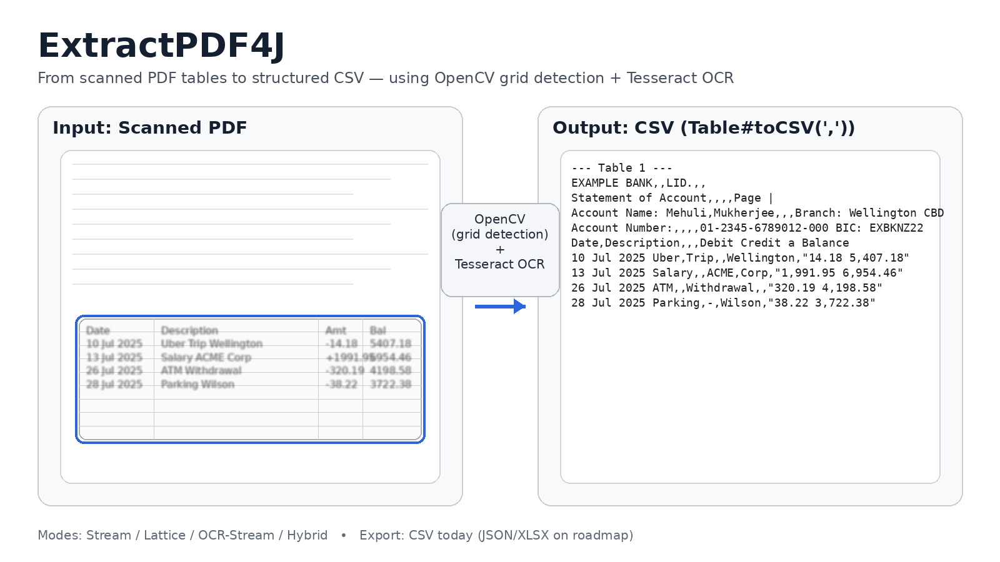

# ExtractPDF4J

A production-focused **Java** library for extracting **tables** and structured data from PDFs.
Extract tables from scanned/image PDFs in Java using OCR + table structure detection.

```java
import com.extractpdf4j.helpers.Table;
import com.extractpdf4j.parsers.HybridParser;
import java.util.List;

public class QuickStart {
  public static void main(String[] args) throws Exception {
    // Works for BOTH text-based and scanned PDFs (OCR fallback)
    List<Table> tables = new HybridParser("scanned_invoice.pdf")
        .dpi(300f)
        .parse();

    if (!tables.isEmpty()) {
      System.out.println(tables.get(0).toCSV(','));
    }
  }
}
```

## What problem it solves

Stop hand-retyping tables from scanned invoices, bank statements, or reports.
Extract clean rows + columns even when the PDF has no text layer.

## Magic snippet

The copy/paste quick start is at the top of this README under the project description.

## Install (Maven + Gradle)

**Maven**

```xml
<dependency>
  <groupId>io.github.extractpdf4j</groupId>
  <artifactId>extractpdf4j-parser</artifactId>
  <version>2.0.0</version>
</dependency>
```

```xml
<dependency>
  <groupId>io.github.extractpdf4j</groupId>
  <artifactId>extractpdf4j-core</artifactId>
  <version>2.0.0</version>
</dependency>
```

```xml
<dependency>
  <groupId>io.github.extractpdf4j</groupId>
  <artifactId>extractpdf4j-cli</artifactId>
  <version>2.0.0</version>
</dependency>
```

```xml
<dependency>
  <groupId>io.github.extractpdf4j</groupId>
  <artifactId>extractpdf4j-service</artifactId>
  <version>2.0.0</version>
</dependency>
```

**Gradle**

```kotlin
implementation("io.github.extractpdf4j:extractpdf4j-parser:2.0.0")
```

```kotlin
implementation("io.github.extractpdf4j:extractpdf4j-core:2.0.0")
```

```kotlin
implementation("io.github.extractpdf4j:extractpdf4j-cli:2.0.0")
```

```kotlin
implementation("io.github.extractpdf4j:extractpdf4j-service:2.0.0")
```

### Why this vs Tabula/PDFBox (comparison table)

| Feature | ExtractPDF4J | Tabula-Java | PDFBox |
| --- | --- | --- | --- |
| Text-based PDFs | ✅ | ✅ | ✅ |
| Scanned/Image PDFs | ✅ Native OCR | ❌ | ❌ |
| Table recognition | ✅ Stream/Lattice/OCR-hybrid | ✅ | ❌ (raw text) |
| “Hello world” time | Low (single entrypoint) | Medium | High |

## Use cases (3 quick examples)

### Extract from scanned PDF (OCR)

```java
import com.extractpdf4j.helpers.Table;
import com.extractpdf4j.parsers.OcrStreamParser;
import java.util.List;

List<Table> tables = new OcrStreamParser("scanned_invoice.pdf")
  .dpi(300f)
  .parse();
```

### Extract from text-based PDF (stream/lattice)

```java
import com.extractpdf4j.helpers.Table;
import com.extractpdf4j.parsers.StreamParser;
import java.util.List;

List<Table> tables = new StreamParser("statement.pdf")
  .pages("1-2")
  .parse();
```

### Batch extraction (folder → CSV)

```java
import com.extractpdf4j.helpers.Table;
import com.extractpdf4j.parsers.HybridParser;
import java.io.File;
import java.nio.file.Files;
import java.nio.file.Path;
import java.util.List;

for (File pdf : new File("./invoices").listFiles(f -> f.getName().endsWith(".pdf"))) {
  List<Table> tables = new HybridParser(pdf.getPath())
    .dpi(300f)
    .parse();
  if (!tables.isEmpty()) {
    Files.writeString(Path.of("./out/" + pdf.getName() + ".csv"), tables.get(0).toCSV(','));
  }
}
```
## Annotation-based configuration

If you prefer declarative configuration, you can annotate a class and build the parser
from that annotation.

```java
import com.extractpdf4j.annotations.ExtractPdfAnnotations;
import com.extractpdf4j.annotations.ExtractPdfConfig;
import com.extractpdf4j.annotations.ParserMode;
import com.extractpdf4j.parsers.BaseParser;

@ExtractPdfConfig(
  parser = ParserMode.HYBRID,
  pages = "all",
  dpi = 300f,
  debug = true
)
class InvoiceParserConfig {}

BaseParser parser = ExtractPdfAnnotations.parserFrom(InvoiceParserConfig.class, "invoice.pdf");
```

## Tesseract/OpenCV setup (only what’s necessary)

- **Recommended**: use the Bytedeco `*-platform` artifacts so native binaries are bundled.
- If you bring your own OCR/OpenCV install, ensure native libraries are on the OS path (`LD_LIBRARY_PATH`/`DYLD_LIBRARY_PATH`/`PATH`).
- For OCR, set `TESSDATA_PREFIX` if Tesseract language data is not found.

## API reference (Javadocs link)

- Javadocs: https://extractpdf4j.github.io/ExtractPDF4J/
---
## Sample PDFs

The `/examples` directory contains publicly available, non-sensitive PDF files
that can be used to test and understand different extraction scenarios supported
by ExtractPDF4J.

- **sample_utility_bill.pdf**  
  A sample utility bill demonstrating structured text extraction, including
  dates, addresses, account identifiers, and billing totals.

- **sample_monthly_statement.pdf**  
  A multi-page sample financial statement demonstrating table extraction from
  repeated layouts and tabular data. All content is explicitly marked as sample data.

---
## Visual examples





---

# Developer documentation

This section keeps the full project details (architecture, CLI, configuration, and setup) for contributors.

## Architecture

```
PDF (text-based) ──► PDFBox text positions ─┐
                                            ├─► StreamParser ──► Table (cells)
PDF (scanned)    ──► Render to image ──► OpenCV lines/grids ──► LatticeParser ──► Table
                                           └─► OCR (Tesseract) ──────► OcrStreamParser
HybridParser ── coordinates and merges results from the above
```

- `BaseParser` provides core workflow (file path, page ranges, `parse()` pipeline).
- `StreamParser` works from PDFBox text coordinates.
- `LatticeParser` runs line detection, grid construction, and cell assignment.
- `OcrStreamParser` adds OCR text where no text layer exists.
- `HybridParser` orchestrates multiple strategies, returning a `List<Table>`.

## CLI Quickstart

The CLI defaults to **hybrid mode**. If you do not pass `--mode`, it behaves like `--mode hybrid`.

```bash
java -jar extractpdf4j-parser-<version>.jar input.pdf \
  --pages all \
  --out tables.csv
```

Common flags:

- `--mode stream|lattice|ocrstream|hybrid` (default: hybrid)
- `--pages 1|all|1,3-5`
- `--sep ,` (CSV separator)
- `--out out.csv` (omit to print to STDOUT)
- `--dpi 300` (use 300–450 for scans)
- `--debug` and `--debug-dir debug/`
- `--ocr auto|cli|bytedeco`

See also the changelog entry for this documentation pass: [CHANGELOG](CHANGELOG.md).

## Project Status

- Build tool: **Maven**
- Coordinates (current): `io.github.extractpdf4j:extractpdf4j-parser:2.0.0`
- Java: **17+** (recommended 17+ runtime)

## Requirements

- **JDK**: 17+
- **OS**: Linux / macOS / Windows
- **Libraries**:
  - Apache **PDFBox**
  - Bytedeco **OpenCV** (with native binaries)
  - (Optional) Bytedeco **Tesseract** + **Leptonica** for OCR

> Tip: Prefer bytedeco `*-platform` artifacts. They ship native binaries and avoid manual OS setup.

## Install (detailed)

### Maven

```xml
<dependency>
  <groupId>io.github.extractpdf4j</groupId>
  <artifactId>extractpdf4j-parser</artifactId>
  <version>2.0.0</version>
</dependency>
```

### Gradle

```kotlin
implementation("io.github.extractpdf4j:extractpdf4j-parser:2.0.0")
```

### Native Notes

- If using bytedeco `*-platform`, you should **not** need extra steps.
- If you bring your own OpenCV/Tesseract:
  - Ensure the native libs are on your OS library path (e.g., `LD_LIBRARY_PATH`, `DYLD_LIBRARY_PATH`, or Windows `PATH`).
  - Set `TESSDATA_PREFIX` to find language data if OCR is enabled.

## Quick Start (detailed)

### Stream (Text-based)

```java
import com.extractpdf4j.helpers.Table;
import com.extractpdf4j.parsers.StreamParser;
import java.nio.file.*;
import java.util.List;

public class StreamQuickStart {
  public static void main(String[] args) throws Exception {
    List<Table> tables = new StreamParser("samples/statement.pdf")
            .pages("1-3")   // or "all"
            .parse();

    if (!tables.isEmpty()) {
      Files.createDirectories(Path.of("out"));
      Files.writeString(Path.of("out/stream_table.csv"), tables.get(0).toCSV(','));
    }
  }
}
```

### Lattice (Ruled/Scanned)

```java
import com.extractpdf4j.helpers.Table;
import com.extractpdf4j.parsers.LatticeParser;
import java.io.File;
import java.nio.file.*;
import java.util.List;

public class LatticeQuickStart {
  public static void main(String[] args) throws Exception {
    List<Table> tables = new LatticeParser("samples/scanned.pdf")
            .dpi(300f)           // common for scans
            .keepCells(true)     // keep empty cells (if method is present)
            .debug(true)         // write debug artifacts (if method is present)
            .debugDir(new File("out/debug"))
            .pages("all")
            .parse();

    Files.createDirectories(Path.of("out"));
    for (int i = 0; i < tables.size(); i++) {
      Files.writeString(Path.of("out/lattice_table_" + i + ".csv"), tables.get(i).toCSV(','));
    }
  }
}
```

### Hybrid (Mixed Documents)

```java
import com.extractpdf4j.helpers.Table;
import com.extractpdf4j.parsers.HybridParser;
import java.util.List;

public class HybridQuickStart {
  public static void main(String[] args) throws Exception {
    List<Table> tables = new HybridParser("samples/mixed.pdf")
            .pages("all")
            .parse();
    // process tables as needed
  }
}
```

### OCR-assisted Stream

```java
import com.extractpdf4j.helpers.Table;
import com.extractpdf4j.parsers.OcrStreamParser;
import java.util.List;

public class OcrQuickStart {
  public static void main(String[] args) throws Exception {
    List<Table> tables = new OcrStreamParser("samples/scan.pdf")
            .pages("1-2")
            .parse();
  }
}
```

## CLI

Run the bundled CLI to extract tables from a PDF.

Usage:

```bash
java -jar extractpdf4j-parser-<version>.jar <pdf>
     [--mode stream|lattice|ocrstream|hybrid]
     [--pages 1|all|1,3-5]
     [--sep ,]
     [--out out.csv]
     [--debug]
     [--dpi 300]
     [--ocr auto|cli|bytedeco]
     [--keep-cells]
     [--debug-dir <dir>]
     [--min-score 0-1]
     [--require-headers Date,Description,Balance]
```

- **--pages**: page selection. Accepts `"1"`, `"2-5"`, `"1,3-4"`, or `"all"`.
  - Examples:
    - `--pages 1` → only page 1
    - `--pages 1-3` → pages 1,2,3
    - `--pages 1-3,5` → pages 1,2,3 and 5
    - `--pages all` → all pages

Examples:

```bash
java -jar extractpdf4j-parser-<version>.jar scan.pdf --mode lattice --pages 1 --dpi 450 --ocr cli --debug --keep-cells --debug-dir debug_out --out p1.csv
java -jar extractpdf4j-parser-<version>.jar statement.pdf --mode hybrid --pages all --dpi 400 --out tables.csv
```

Notes:

- When `--out` is omitted, tables are printed to STDOUT in CSV form.
- When multiple tables are found and `--out` is provided, files are numbered by suffix (e.g., `out-1.csv`, `out-2.csv`).
- `--ocr` sets a system property read by OCR helpers; values: `auto`, `cli`, or `bytedeco`.

## Microservice (via Docker)

This project includes a sample Spring Boot microservice that exposes a REST endpoint for PDF table extraction, fulfilling the requirements of a best-practice deployment.

### Requirements

- [Docker](https://www.docker.com/get-started) must be installed and running on your system.

### Building the Docker Image

Navigate to the project's root directory (where the `Dockerfile` is located) and run the following command. This command builds the Docker image using the provided multi-stage `Dockerfile` and tags it with the name `extractpdf4j-service`.

```bash
docker build -t extractpdf4j-service .
```

### Running the Microservice

Once the image has been successfully built, you can run the microservice inside a container using the following command. This will start the service and map the container's internal port 8080 to port 8080 on your local machine, making it accessible.

```bash
docker run -p 8080:8080 extractpdf4j-service
```

Alternatively, you can run the service directly from the command line after building the project.

```bash
java -jar target/extractpdf4j-parser-<version>.jar
```

After running either command, you will see the Spring Boot application startup logs in your terminal.

### Using the Endpoint

The service provides a POST endpoint at `/api/extract` for processing PDF files.

Example using curl:

```bash
curl -X POST -F "file=@Scanned_Bank_Statement.pdf" http://localhost:8080/api/extract
```

Expected Response

The service will respond with a 200 OK status and a plain text body containing the extracted table(s) in CSV format.

```
--- Table 1 ---
EXAMPLE BANK,,LID.,,
Statement of Account,,,,Page |
Account Name: Mehuli,Mukherjee,,,Branch: Wellington CBD
Account Number:,,,,01-2345-6789012-000 BIC: EXBKNZ22
bate,Description,,,Debit Credit a Balance
10 Jul 2025 Uber,Trip,,Wellington,"14.18 i 5,407.18"
“aaju 2025 Spotify,,, ,"112.47 5,294.74"
“42 Jul 2025,Electricity,-,Meridian,"332.20 a 4,962.5 |"
43 Jul 2025 Salary,,ACME,Corp,"1,991.95 6,954.46"
“14 jul2025 ATM,,Withdrawal,,"632 6,938.14"
FE Jjul2025 Rent,,Payment,,oe 407000 (stsi<Cs~*st‘is~*«~S BBL
i Jul 2025 POs,,1234,Countdown,"Lambton 253.88 6,577.26"
117 Jul 2025,Groceries,-,New,"World 101.54 | 6,475.72"
“18 jul 2025,Spotify,,,"364.82 6,110.90"
“49 Jul 2025 POS,,1234,Countdown,Lambton 342.19 _ 5768.7 |
"""20 Jul2025.Watercare",,Bill,,"315.07 5,453.64"
2 Jul 2025,Coffee -,Mojo,,"127.21 5,326.4"
“23 4Jul2025,Coffee-Mojo,,,gg 6 4846.83
“24 Jul 2025,Parking -,Wilson,,"2B 4,800.64"
"""25 Jul2025",—Fuel-Z,Energy,,"a72eT 4,527.74"
26 Jul 2025 ATM,,Withdrawal,_ ,"320.19 4,198.58"
27 Jul 2025 Uber,Trip,,Wellington,"437.98 3,760.64"
28 Jul 2025,Parking,-,Wilson,"7 38.22 3,722.38"
29 Jul2025 _,Insurance,-,Tower,"373874 3,348.64"
30 Jul 2025 Fuel,-7,Energy,,261.08 a 3.087.5¢
31 Jul 2025,Salary,ACME,Corp,"385.18 3,472.74"
For queries call,0800 000,000,or visit,examplebank.nz
```

## Configuration

- `BaseParser#pages(String)` — set page ranges (e.g., `"1"`, `"2-5"`, `"1,3-4"`, or `"all"`).
- `LatticeParser` chainable options (available in source): `dpi(float)`, `keepCells(boolean)`, `debug(boolean)`, `debugDir(File)`.

> A full `ParserConfig` builder is **not** in this repository. If you want that style, we can add it in a minor release without breaking the current API.

## YAML Rules (Normalization)

While extraction focuses on finding table cells, many workflows need consistent headers and typed values. You can maintain a small YAML file to normalize results downstream (header aliases, alignment to canonical names, and date/number formats). Example:

```yaml
headers:
  aliases:
    "Txn Date": ["Transaction Date", "Date"]
    "Description": ["Details", "Narration"]
    "Amount": ["Debit/Credit", "Amt"]

schema:
  align:
    - ["Txn Date", "Description", "Amount"]

formats:
  date:
    input: ["yyyy-MM-dd", "dd/MM/yyyy", "dd-MMM-uuuu"]
    output: "yyyy-MM-dd"
  number:
    decimal_separator: "."
    thousand_separator: ","
    currency_symbols: ["$", "₹", "€"]
```

How to apply:

- Map extracted header texts to canonical names using `headers.aliases`.
- Reorder/ensure columns using `schema.align`.
- Parse and reformat values using `formats.date` and `formats.number`.

Note: The core library does not interpret YAML natively; this pattern keeps normalization explicit in your app while remaining stable across parser updates.

## Logging

This project uses [SLF4J](https://www.slf4j.org/). You can bind it to any backend (e.g., Logback, Log4j2, or the simple logger).

- **INFO** logs announce when a table is detected
- **DEBUG** logs provide details:
  - inferred column boundaries
  - detected row positions
  - final grid dimensions

### Enable DEBUG logs

If using the SLF4J Simple backend (`slf4j-simple`), enable debug output with:

```bash
java -Dorg.slf4j.simpleLogger.defaultLogLevel=debug
```

## Exports

- **CSV**: `Table#toCSV(char sep)` → returns the CSV as a string.
- **Programmatic access**: common accessors include `nrows()`, `ncols()`, and `cell(int row, int col)` (if present in your Table class).

**CSV example**

```java
Files.writeString(Path.of("out/table.csv"), table.toCSV(','));
```

(If you want bulk exports, add the optional `Results` helper and use `Results.exportAllCsv(tables, Path.of("out/csv"), ',');`.)

## Performance Tips

- Prefer **page ranges** (`pages("1-3")`) over `"all"` when you know where tables are.
- For scans, choose appropriate **DPI** (e.g., 300f). Try `keepCells(true)` to preserve empty grid cells.
- Enable `debug(true)` in `LatticeParser` when tuning; inspect overlays and artifacts in `debugDir`.
- Process files in parallel if you have lots of independent documents.

## OCR Preprocessing Tips

For image/scanned PDFs, use lattice or OCR-assisted parsing. Helpful flags and settings:

- `--dpi 300` (try 300–450); higher DPI improves line and OCR accuracy.
- `--ocr auto|cli|bytedeco` to choose OCR backend. Default is `auto`.
- `--debug --debug-dir debug/` to dump intermediate artifacts.
- System properties for OCR CLI fine-tuning:
  - `-Dtess.lang=eng` language
  - `-Dtess.psm=6` page segmentation mode (6 = uniform block)
  - `-Dtess.oem=1` engine mode
  - `-Docr.debug=true` to dump last TSV when no words are detected

Example (lattice, 450 DPI, CLI OCR, debug artifacts):

```bash
java -Dtess.lang=eng -Dtess.psm=6 -Dtess.oem=1 -Docr.debug=true \
  -jar extractpdf4j-parser-<version>.jar scan.pdf \
  --mode lattice --dpi 450 --ocr cli --debug --debug-dir debug \
  --out tables.csv
```

Before/after (conceptual):

- Before: low-DPI scan at 150, faint grid → few or no tables detected.
- After: re-run at `--dpi 400` with `--debug` to inspect binarization; switch to `--mode ocrstream` if the text layer is missing.

## Error Handling

- `parse()` methods throw `IOException` for file issues.
- When no tables are found, parsers typically return an **empty list** — check `tables.isEmpty()` before writing files.

## Known Limitations

- Low-resolution or skewed scans can reduce grid detection and OCR accuracy.
- Handwritten notes/stamps can confuse line detection; crop or pre-process to avoid noisy regions.
- Nested/complex tables work best with lattice; hierarchical exports (JSON/XLSX) require additional code.

## FAQ / Troubleshooting (top 6 issues)

1. **OCR not kicking in on scanned PDFs** → Use `OcrStreamParser` or `HybridParser` and ensure OCR dependencies are available.
2. **UnsatisfiedLinkError for OpenCV/Tesseract** → Switch to `*-platform` dependencies or fix your native library path.
3. **Tables missing in scans** → Increase DPI (300–450) and try lattice/hybrid mode.
4. **Garbled OCR text** → Verify `TESSDATA_PREFIX` and language packs (e.g., `eng`).
5. **Multiple tables per page** → Iterate over results instead of assuming a single table.
6. **Slow extraction** → Limit page ranges and avoid high DPI unless needed.

## Roadmap

- JSON/XLSX export helpers, optional `AutoParser`, and more batch utilities.
- Optional **AutoParser** (delegates to `HybridParser`) — convenience wrapper.
- `Table#toJson()` and `Table#toXlsx(Path)` methods.
- `Results.exportAllCsv/Json(...)` bulk helpers.
- (Future) A formal `ParserConfig` builder with common options.

A **stubs & patch** bundle is available to enable these APIs today without breaking changes.

## Contributing

PRs welcome! For lattice/OCR changes, include screenshots of debug artifacts if possible. Keep sample PDFs **tiny and sanitized**.
(See `CONTRIBUTING.md`)

## Versioning

Semantic Versioning (**SemVer**): MAJOR.MINOR.PATCH.

## License

ExtractPDF4J is licensed under Apache-2.0 (See `LICENSE`).

## Acknowledgements

- Inspired by **Camelot** (Python) and **Tabula**.
- Built on **Apache PDFBox**, **OpenCV/JavaCV**, and **Tesseract**.
- Thanks to contributors and users who reported edge cases and shared sample PDFs.
